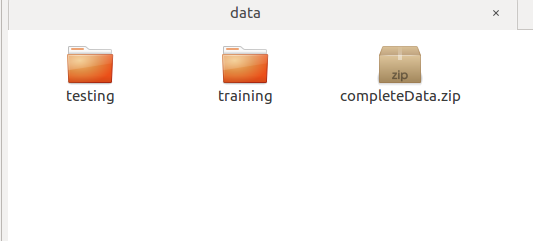

# TesnsorFlow-Basics-MNIST
This Repository goes through from Basic-Advance Neural Network implementation on Tensorflow using MNIST Data.<br/><br/>
# Repository<br/>
It contains :<br/>
1.**CODE** ---> It contains all the necessary Configuration and Python File.<br/><br/>
<br/><br/><br/>
2. **DATA** ----> It contains the MNIST Dataset.The **ZIP** file contains the complete Dataset for MNIST i.e. 60,000 Training Images and 10000 Test Images<br/>
The **Training** folder has only 10000 images and The **Testing** folder has 100 images only. This due to my system memory constraint while training.<br/> 
You can increase and decrease the data.<br/><br/>
<br/><br/>
3. **pythonEnvironment.txt** ----> It contains all the python packages version that was present in tmy system at the time.<br/>
The main package you need to inatall in tensorflow.<br/>
# Installation<br/>
Tensorflow for **CPU** installation.<br/>
```
pip3 install tensorflow
```
Tensorflow for **GPU** installation.<br/>
```
pip3 install tensorflow-gpu
```
# Run<br/>
GO inside code directory and run the **Main** file<br/>
```
python3 main.py
```
# Credits<br/>
The code in this repository is inspired by my learning that I gained by the completion of the following Course. Make sure to check it out. Big thanks to Andrew Ng for such an amazing course.
[https://www.coursera.org/specializations/deep-learning]
